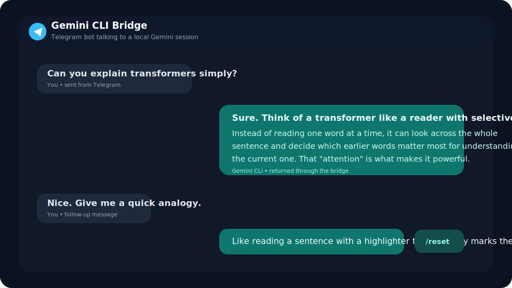
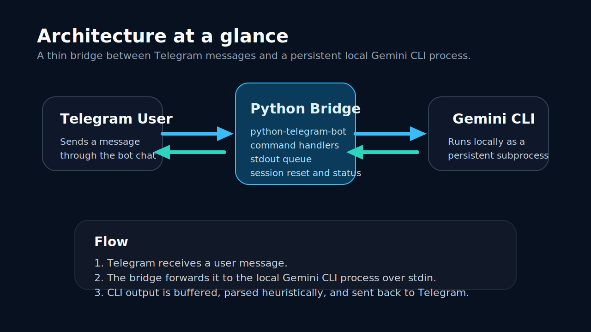

# Telegram Gemini CLI Bridge

Talk to a local Gemini CLI session from Telegram.

This project is a lightweight Python bridge for people who like the speed of a terminal-based AI workflow but want the convenience of sending prompts from their phone. You message a Telegram bot, the bridge forwards that message to a local `gemini` CLI process, and the reply comes back into the same chat.

It is a small utility project built for real use: simple to follow, easy to modify, and practical enough to run on a personal machine or small server.



## Why this exists

Sometimes you do not want a full dashboard, browser tab, or remote desktop session.

Sometimes you just want to:
- send a quick prompt from Telegram
- get a reply from the Gemini CLI already running on your machine
- keep the setup small enough to understand in one sitting

That is the point of this repo.

## What it does

- listens for Telegram messages
- forwards each message to a local `gemini` CLI subprocess
- reads the CLI output and sends it back to Telegram
- keeps the CLI session alive for faster follow-up replies
- supports `/start`, `/help`, `/status`, and `/reset`

## Screenshot

The preview below shows the intended chat flow and overall feel of the project.



## Architecture

This is intentionally small.

There are only three moving parts:
- `Telegram` is the chat surface where the user sends prompts.
- `telegram_gemini_bridge.py` is the bridge layer that manages handlers, process lifecycle, and response buffering.
- `Gemini CLI` runs locally as a persistent subprocess and does the actual model interaction.

In plain terms:
1. A Telegram message reaches the bot.
2. The Python bridge writes that message to Gemini CLI over `stdin`.
3. The bridge collects CLI output from `stdout`.
4. The response is sent back to Telegram.

The parsing logic is heuristic because CLI output can vary between Gemini CLI versions. The goal here is pragmatism, not over-engineering.

## Project structure

```text
.
|-- assets/
|   |-- architecture-overview.svg
|   `-- telegram-chat-preview.svg
|-- .env.example
|-- .gitignore
|-- requirements.txt
`-- telegram_gemini_bridge.py
```

## Requirements

- Python 3.9 or newer
- a Telegram bot token from `@BotFather`
- Gemini CLI installed and available on your `PATH`

## Quick start

1. Create a virtual environment.
2. Install dependencies:

```bash
pip install -r requirements.txt
```

3. Copy `.env.example` to `.env`.
4. Fill in your values:

```env
TELEGRAM_BOT_TOKEN=replace_with_your_bot_token
GEMINI_CLI_PATH=gemini
```

5. Start the bot:

```bash
python telegram_gemini_bridge.py
```

6. Open Telegram and send your bot a message.

## Configuration

Environment variables:

| Variable | Purpose | Default |
| --- | --- | --- |
| `TELEGRAM_BOT_TOKEN` | Telegram bot token from `@BotFather` | required |
| `GEMINI_CLI_PATH` | Path or command name for Gemini CLI | `gemini` |
| `LOG_LEVEL` | Logging verbosity | `INFO` |
| `RESPONSE_TIMEOUT` | Max wait time for CLI output | `30` |
| `STARTUP_DELAY_SECONDS` | Delay after launching Gemini CLI | `2` |

## Design choices

- The Gemini process is persistent, so follow-up messages feel faster.
- The code stays in one main file to keep the project easy to audit.
- The response reader is simple on purpose. This is a small utility, not a framework.

## Security notes

- `.env` is ignored and should never be committed.
- Rotate any token that was ever pasted into transcripts, screenshots, or local history.
- If you fork this project, use your own Telegram bot token and local Gemini setup.

## Good next improvements

- better CLI output boundary detection
- optional per-user session isolation
- structured logging
- Docker support
- deployment guide for a small VPS or homelab box

## Who this is for

This repo is useful if you are:
- experimenting with AI workflow tooling
- building small automation utilities
- learning how to bridge a chat interface to a local CLI process
- looking for a simple, readable Python integration project

## License

MIT
